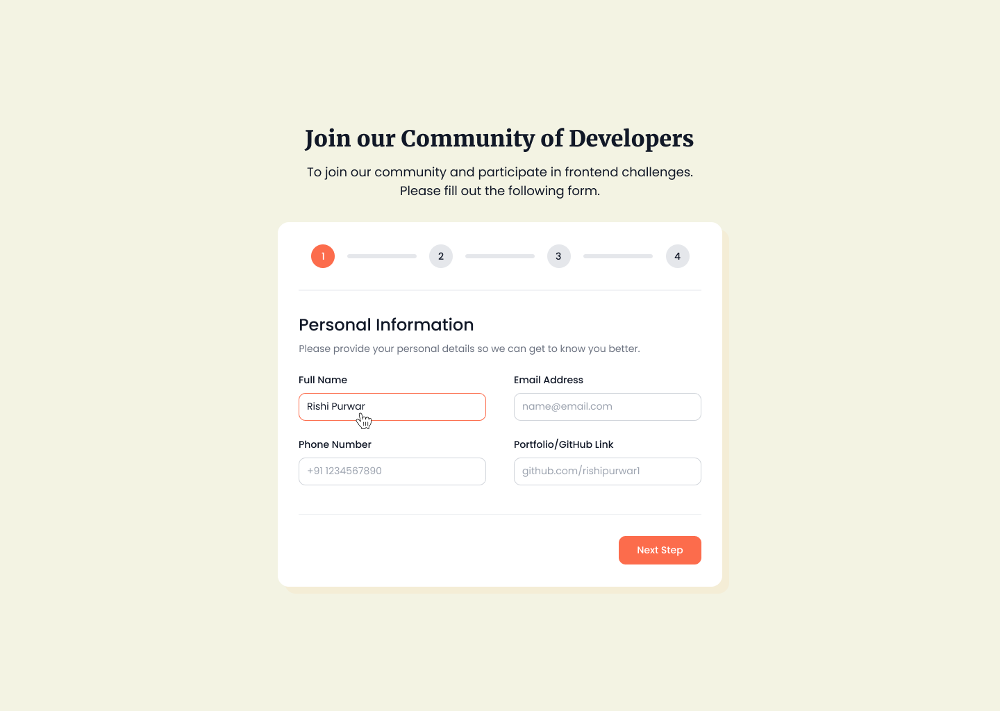

# Multi-step Form - Frontend Pro

Multi-step Form is a front-end challenge from [FrontendPro](https://www.frontendpro.dev/), the goal of the challenge is to join the community of developers filling out the personal, skill level, challenge preference and in the end review the information.



## Requirements

1. Must be accessible: the user must be able to complete the form and understand the page context via assistive technologies
2. Desktop only: it does not need to be responsive
3. Progress bar:
   1. it must be able to back to the previous form
   2. it should not be able to move forward if the form is not valid
   3. it should be able to move between the steps. Ex.: from 4 to 1
4. When reload the page:
   1. it should back to the first step, Personal Information
   2. all the form data should be empty
5. It must be able to move back and forward using the browser back and forward arrows
6. Form validations (all the fields are required)
   1. Full Name must be string and not accept special characters, except `‘, -`
   2. Email Address must be a valid email
   3. Phone Number must be a valid US phone number
   4. Portfolio/GitHub Link must be a valid URL
   5. Skill Level must be one of them: Begginer, Intermidiate, Advanced or Expert
   6. Challenge Preference must be one of them: HTML/CSS/JS, React, Angular.js or Vue.js

## Tech Stack

- Next.js
- CSS Modules
- Storybook
- Storybook Visual Tests
- Playwright

## Running the application

1. Install the dependencies

```
pnpm install
```

2. Run the application in dev mode

```
pnpm dev
```

## Links

- [Multi-step Form - FrontendPro (Figma)](https://www.figma.com/design/oWZGl1lvaf8ehXmsa4CJVi/Multi-Step-Form?node-id=0-1&node-type=canvas&t=2GmFYoa5jNyI3Y8k-0)
- [Multi-step Form - FrontendPro (Challenge)](https://www.frontendpro.dev/frontend-coding-challenges/multi-step-form-lyFZYpe2Uxc8Ng4ueYud)
